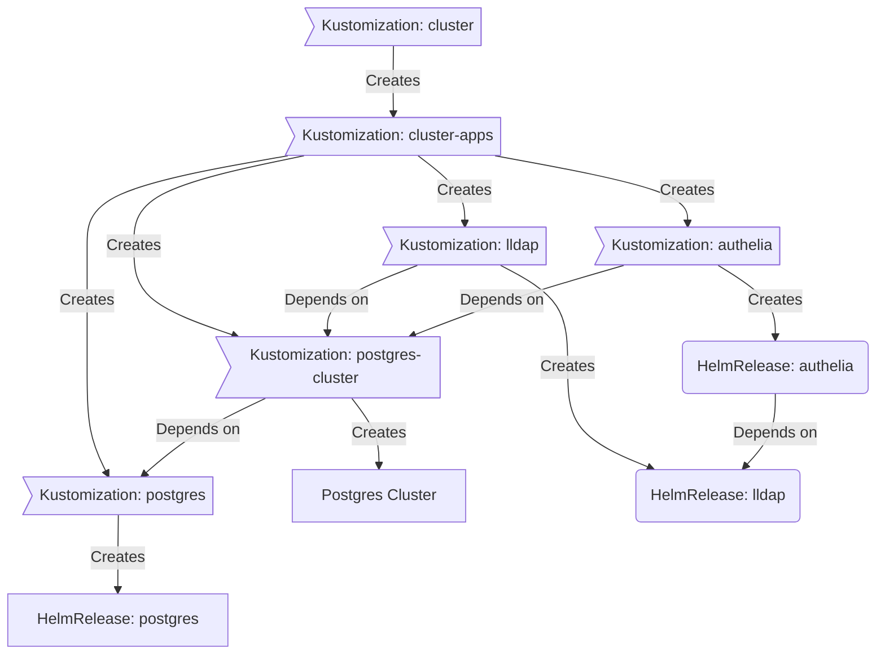

<div align="center">


### My Home Operations Repository :house_with_garden:

_... managed via Kubernetes, Flux, and Renovate_ 🤖

</div>

<div align="center">

[](https://k3s.io/)&nbsp;&nbsp;
[](https://status.vember31.xyz/endpoints/external_status)&nbsp;&nbsp;
[](https://status.vember31.xyz/endpoints/internal_plex)


</div>

## 📖 Overview

This is a mono repository for my home infrastructure and Kubernetes cluster. This follows Infrastructure as Code (IaC) and GitOps practices using [Kubernetes](https://kubernetes.io/), [Flux](https://github.com/fluxcd/flux2) and [Renovate](https://github.com/renovatebot/renovate).

## ⛵ Kubernetes

There is a template over at [onedr0p/flux-cluster-template](https://github.com/onedr0p/flux-cluster-template) if you want to follow along with some of the practices in use here. This repository was not created via this template, but was heavily inspired by its structure.

### Installation

This cluster is [k3s](https://k3s.io/) provisioned atop Ubuntu Server VMs, which are hosted in Proxmox. This is a semi-hyper-converged cluster, where workloads and block storage share the same available resources on nodes.  Two of the nodes also run OpenMediaVault, utilizing XFS & MergerFS as file systems, and serve NFS, SMB, S3 (via [MinIO](https://min.io)) and provide bulk file storage and Longhorn backups. These bulk storage drives are backed up via SnapRAID on a weekly schedule.

### Core Components

- [cert-manager](https://cert-manager.io/docs/): manages SSL X509 certificates for all http-based services
- [cloudnative-pg](https://cloudnative-pg.io): high-availability PostgreSQL database built for Kubernetes
- [eraser](https://github.com/eraser-dev/eraser): removes non-running images from all nodes
- [external-dns](https://github.com/kubernetes-sigs/external-dns): automatically syncs DNS records from cluster ingresses to a DNS provider (Cloudflare)
- [external-secrets](https://github.com/external-secrets/external-secrets/): managed Kubernetes secrets using Gitlab CI/CD variables
- [kured](https://github.com/kubereboot/kured): Kubernetes daemonset that performs safe automatic node reboots when the need to do so is indicated by the package management system of the underlying OS
- [kube-prometheus-stack](https://github.com/prometheus-operator/kube-prometheus): Prometheus, Grafana, Alertmanager & Thanos, bundled into one helm chart for high-availability observability & monitoring
- [longhorn](https://github.com/longhorn/longhorn): distributed block storage for Kubernetes volume persistence
- [system-upgrade-controller](https://github.com/rancher/system-upgrade-controller): automated, rolling k3s version upgrades
- [traefik](https://github.com/traefik/traefik): ingress controller for Kubernetes, acting as a modern HTTP reverse proxy and load balancer

### GitOps

[Flux](https://github.com/fluxcd/flux2) watches the cluster defined in the [kubernetes](./kubernetes/) folder (see Directories below) and makes the changes to the cluster based on the state of this Git repository.

Flux works by recursively searching the `kubernetes/apps` folder until it finds the most top-level `kustomization.yaml` per directory, and then applies all resources listed in it. That aforementioned `kustomization.yaml` will generally have a namespace resource and one or many Flux kustomizations (`ks.yaml`). Under the control of those Flux kustomizations there will be a `HelmRelease` or other resources related to the application which will be applied.

[Renovate](https://github.com/renovatebot/renovate) watches the **entire** repository looking for dependency updates. When updates are found, PRs are automatically created. Flux applies the changes to the cluster once PRs are merged.

### Directories

This Git repository contains the following directories under [Kubernetes](./kubernetes/).

```sh
📁 kubernetes
├── 📁 apps           # applications
├── 📁 bootstrap      # bootstrap procedures
├── 📁 flux           # core flux configuration
└── 📁 templates      # reusable components
```

### Flux Workflow

This is a high-level look how Flux deploys applications with dependencies. Below there are 3 example apps: `postgres`, `lldap` and `authelia`. `postgres` is the first app that needs to be running and healthy before `lldap` and `authelia`. Once `postgres` is healthy `lldap` will be deployed and after that is healthy `authelia` will be deployed.



## 🌐 DNS

A UDM Pro SE is the center of the network. DHCP leases point to [Blocky](https://github.com/0xERR0R/blocky) as the primary DNS and [AdGuard Home](https://github.com/AdguardTeam/AdGuardHome) as secondary. Blocky is hosted within the Kubernetes cluster as a daemonset for high availability across 4 nodes (5 VMs), and AdGuard Home is hosted in an LXC container on one of the nodes. MetalLB announces these routes via BGP to achieve true high-availability for clients to have direct routes to each node. A spare Raspberry Pi is available for further redundancy.

Blocky / AdGuard Home resolve all local (`*.local.${SECRET_DOMAIN}`) DNS entries to Traefik (reverse proxy), which directs to the appropriate ingress. All forwarded DNS queries that leave the cluster are sent via DoT to Cloudflare.


## 🔧 Hardware


| Device                      | Count | OS Disk Size | Data Disk Size              | Ram  | Operating System | Purpose             |
|-----------------------------|-------|--------------|-----------------------------|------|------------------|---------------------|
| HP Workstation Z620         | 1     | 1TB SSD      | 1TB SSD                     | 96GB | Ubuntu           | Kubernetes Server   |
| Lenovo Workstation          | 1     | 250GB SSD    | 8TB HDD                     | 8GB  | Ubuntu           | Kubernetes Server   |
| Dell Optiplex Mini          | 1     | 1TB SSD      | 3x8TB  (mergerfs,snapraid)  | 32GB | Ubuntu           | Kubernetes Server   |
| GMKTec Nuc @ i7-12650H      | 1     | 1TB SSD      | 1TB SSD                     | 24GB | Ubuntu           | Kubernetes Server   | 
| Unifi UDM Pro SE            | 1     | -            | -                           | -    | -                | 2.5Gb PoE Router    |
| Unifi U6 AP Pro             | 4     | -            | -                           | -    | -                | Access Points       |
| Unifi Switch 24 Pro         | 1     | -            | -                           | -    | -                | 1Gb PoE Switch      |
| Unifi NVR                   | 1     | -            | 8TB HDD                     | -    | -                | NVR                 |
| Unifi G4 Bullet             | 6     | -            | -                           | -    | -                | Security            |


## 🤝 Gratitude and Thanks

Thanks to all the people who donate their time to the [Home Operations](https://discord.gg/home-operations) Discord community. Be sure to check out [kubesearch.dev](https://kubesearch.dev/) for ideas on how to deploy applications or get ideas on what you may deploy.
